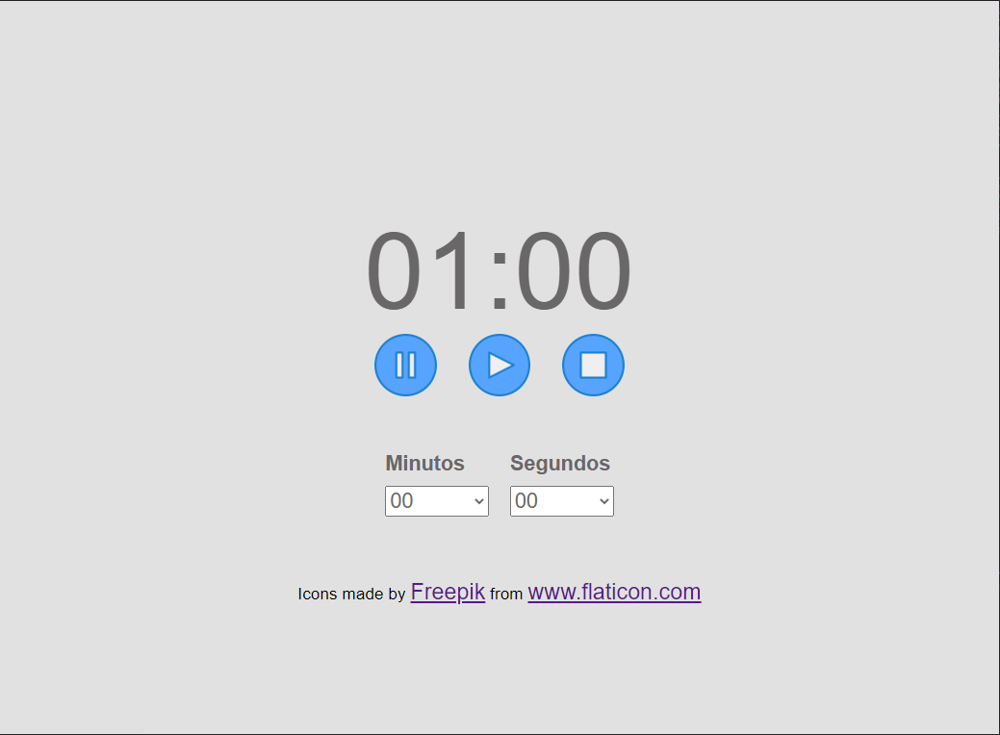
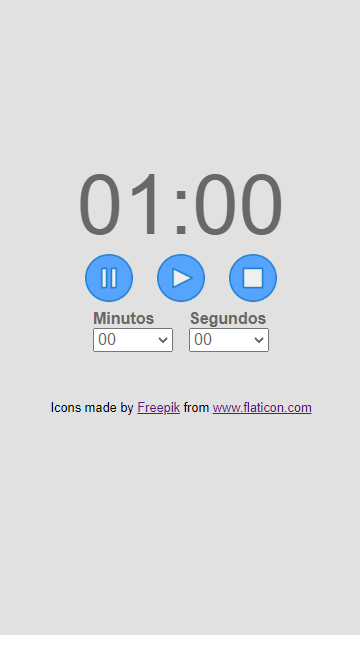

# Temporizador javascript 
## Descrição :clipboard:
Temporizador criado usando apenas HTML, Css e JS. 
## Objetivo :running:
Aplicar conhecimento Javascript e relembrar HTML e CSS e terminar o projeto que foi iniciado faz um tempo, porém, perdido num HD antigo.
## Status :heavy_exclamation_mark:
:construction: Em construção :construction:
## Features :heavy_plus_sign:
- [x] Contador regressivo :clock9:
- [x] Responsividade :iphone:
- [x] Som ao final da contagem :speaker:
## Como usar e requisitos
### Como usar
#### Opção 1, direto do github
  1. Clique [nesse link](https://marcelosantosc.github.io/Temporizador-javascript/) para acessar direto do github pages 
#### Opção 2, baixando e executando sem acessar a internet
  1. Abra o git em uma pasta vazia
  2. Digite 'git clone https://github.com/marceloSantosC/Temporizador-javascript' (sem aspas)
  3. Abra o arquivo index.html
  4. Caso deseje mudar a música basta substituir o arquivo mp3 default.mp3 na pasta 'resources/audio/' por arquivo mp3 de mesmo nome
### Requisitos
  - Navegador compatível
  - Git (apenas na segunda opção)

## Screenshots
### Desktop

### Mobile

